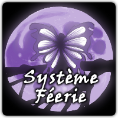

# Système Féerie

Bienvenue sur le site du Système Féerie, un système de jeu de rôle générique descriptif.

Ce système est actuellement utilisé par Solaires un jeu de science-fiction traitant du transhumanisme, de la colonisation spatiale, de la technologie, de l’héroïsme et du paradoxe de Fermi.

## Le Système Féerie en bref

Le Système Féerie est un système de simulation qui favorise la description aux mécaniques habituelles de ces systèmes, que ce soit au niveau de la création des personnages que du système de résolution des actions.

Première particularité, ce système utilise un processus atypique pour la création des personnages : le personnage est initialement défini avec des termes courants, à partir d’un questionnaire ou en rédigeant une description du personnage ; puis les règles transposent simplement et naturellement les éléments de ce personnage en caractéristiques chiffrées qui seront utilisées lors de la résolution des actions. Il n’y a pas de système de points/classe/niveau/archétype pour “encadrer” ou restreindre cette création et dans l’absolu, cette méthode permet de créer n’importe quel personnage de n’importe quel univers.

Dans cette optique descriptive, les règles ne décrivent que des mécaniques de résolution mais sans imposer des règles pour fixer les conséquences (par exemple, il n’y a pas de gestion précise de la santé). Dans l’optique du Système Féerie, ce n’est pas au système de jeu de déterminer précisément comment l’action doit se comporter, mais aux participants. Par ailleurs, les règles de résolution ne font aucune distinction sur la nature des actions à résoudre : pas de spécificité pour, par exemple, le combat.

Le Système Féerie met une partie du pouvoir narratif entre les mains des joueurs qui leur permettent d’influencer directement la trame scénaristique. Par exemple, ils peuvent décrire eux même, sous certaines conditions, le résultat des actions de leur personnage, ou encore modifier, lier ou introduire des éléments scénaristiques. Et ceci grâce aux points de personnage.

Ce système a été conçu pour être simple et rapide à prendre en main. Comme il a été principalement développé pour Solaires, il se destine principalement les jeux d’aventures.

## Règles en ligne

Vous retrouverez les différentes versions du Système Féerie dans les rubriques suivantes :
* [Système Féerie (v5)](Système Féerie V5), la version actuelle que nous vous conseillons ;
* [Système Féerie (v3)](Système Féerie V3)
* [Système Féerie (v2)](Système Féerie V2)
* [Système Féerie (v1)](Système Féerie V1)

## Adaptations

Quelques adaptations sont également disponibles sur la page [Adaptations](Adaptations).